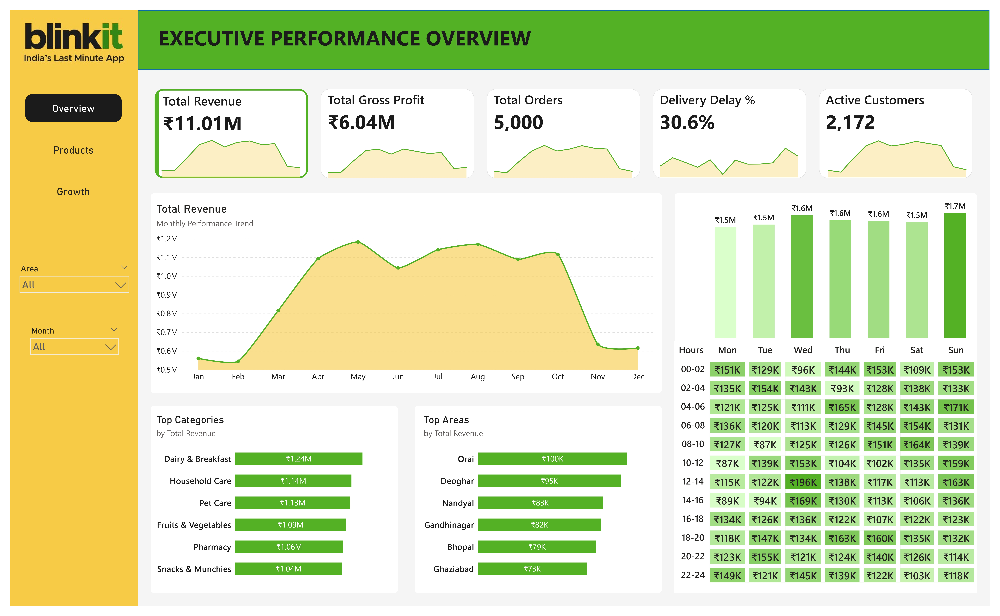

# Blinkit Quick-Commerce Analysis: Supply Chain & Operational Audit 🚀


## Executive Summary
This project performs a full-stack **operational audit** of Blinkit (Quick Commerce) to solve two critical profitability issues: **Inventory Shrinkage (Cash Burn)** and **Customer Churn**. 

Unlike standard dashboards that just show sales, this analysis uses **Python & SQL** to uncover *why* the business is losing money. I identified **₹5 Lakhs in inventory wastage**, a severe **"Leaky Bucket" retention problem (86% Churn)**, and a **"Capacity Paradox"** in delivery operations.

## Project Deliverables
| File | Description |
| :--- | :--- |
| **Reports/Blinkit_Supply_Chain_EDA.pdf** | Full Python Analysis (Inventory Risk, RFM, Cohort, Capacity Planning). |
| **Dashboards/Blinkit_Dashboard.pbix** | Interactive Power BI dashboard for executive monitoring. |
| **Reports/Blinkit_Strategic_Business_Report.pdf** | Business memo summarizing the ₹5L wastage & 30% delay findings. |
| **Scripts/Blinkit_Analysis_Code.ipynb** | Python scripts for Data Cleaning, Feature Engineering & Statistical Tests. |

---

## Key Insights & Findings

### **1. Inventory Health: The "Hidden" Cash Burn **
* **The Discovery:** The analysis exposed **₹506,726** in wasted capital due to overstocking perishable items.
* **Critical Risk:** Identified extreme mismanagement in the "Fresh" category.
    * *Example:* **Onions** (Shelf Life: 3 Days) had **1,244 Days of Stock Cover**.
    * *Example:* **Bread** (Shelf Life: 7 Days) had **600 Days of Stock Cover**.
* **Business Impact:** The "Dairy & Breakfast" category alone is bleeding **11.4% of its revenue** to spoilage.

### **2. Customer Retention: The "Leaky Bucket" **
* **Cohort Analysis:** Retention peaks at only **14% in Month 1**, meaning 86% of acquired users churn immediately.
* **CLV Disparity:** A "Long-Term" user is worth **₹2,362** vs. a New User worth **₹853**.
* **Strategy:** The business is failing to "harvest" value. Marketing spend is high, but the "Activation" phase is broken.

### **3. Operational Efficiency: The "Capacity Paradox" **
* **Hypothesis Busted:** I tested if Order Volume causes delays. The correlation was **-0.11 (Zero)**.
* **The Real Bottleneck:** Delays are driven by **Time (10 AM - 11 AM Rush)**, not Volume or Distance.
* **Conclusion:** The system doesn't break under pressure; it breaks due to poor staffing schedules during specific "Household Rush" hours.

---

## Tech Stack & Techniques
* **Python (Pandas/Seaborn):** Used for **Cohort Analysis** (Retention Heatmap) and **Inventory Risk Modeling** (Stock Cover vs. Shelf Life).
* **SQL (Advanced):** Used CTEs and Window Functions for **RFM Segmentation** and **Moving Averages**.
* **Statistical Analysis:** Correlation Matrix (Volume vs. Delay) and Pareto Analysis (80/20 Rule for Brands).

---

## Visualizations

### **1. Executive Dashboard Overview**
*Interactive view of Total Revenue (₹11M) and Delivery Delays (30.6%).*


### **2. Customer Retention Heatmap**
*Visualizing the drastic 14% drop-off in Month 1.*


### **3. Inventory Risk Matrix**
*Identifying "Rotting" inventory where Stock Cover exceeds Shelf Life.*


---

## 💡 Strategic Recommendations
1.  **Stop the Rot:** Immediate "Clearance Sale" for Onions/Bread to recover sunk costs. Implement an automated **"Freshness Flag"** to block re-ordering if Stock Cover > 50% of Shelf Life.
2.  **Fix the 10 AM Bottleneck:** Shift rider schedules to cover the **10:00 AM - 11:00 AM** household rush (Milk/Veggie orders).
3.  **Gamify Retention:** Since users drop off after Month 1, launch a "3-Streak" gamification feature (Order 3 times in Month 1 to unlock VIP status) to bridge the gap to long-term loyalty.

---

## How to Run
1.  **Clone the Repo:**
    ```bash
    git clone [https://github.com/YourUsername/Blinkit-Supply-Chain-Analytics.git](https://github.com/YourUsername/Blinkit-Supply-Chain-Analytics.git)
    ```
2.  **Install Requirements:**
    ```bash
    pip install pandas seaborn matplotlib sqlalchemy
    ```
3.  **Run the Analysis:**
    Open `Scripts/Blinkit_Analysis_Code.ipynb` to see the code behind the Cash Burn calculation.

---
**Author:** Krishna Varshney
